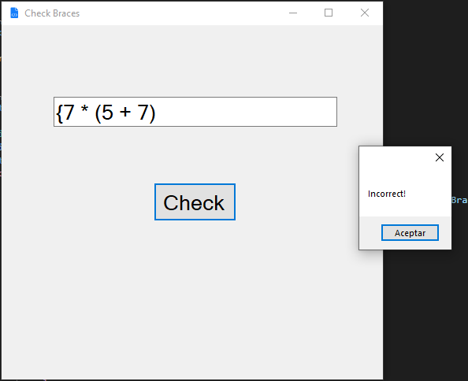
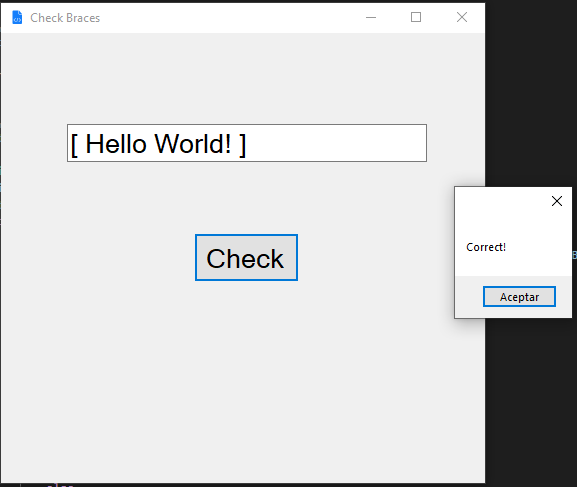

# CheckBraces
Winforms program for check braces

It is a simple program that allows you to check the correct use of braces (Parentheses, Braces & Brackets)

# Features
 - C#
 - WinForms
 - .NET Framework
 - Algorithm that works using lists on a LIFO basis (Last in, First Out)
# Examples
1. Hello world! => Correct!
2. (Hello World!) => Correct!
3. (Hello World! => Incorrect!
4. (Hello World!] =! Incorrect!
5. (24 + 3) - 7} => Incorrect!

# Images

 
  

 
  

